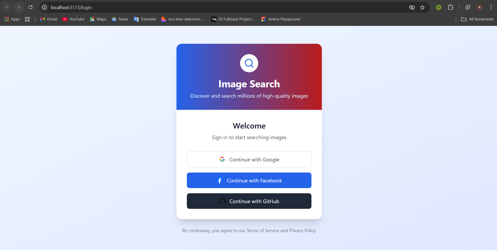
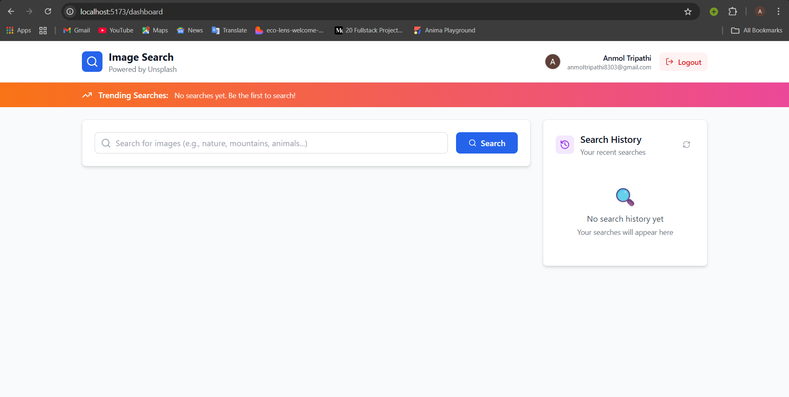
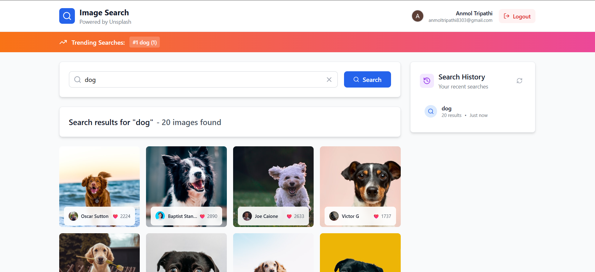
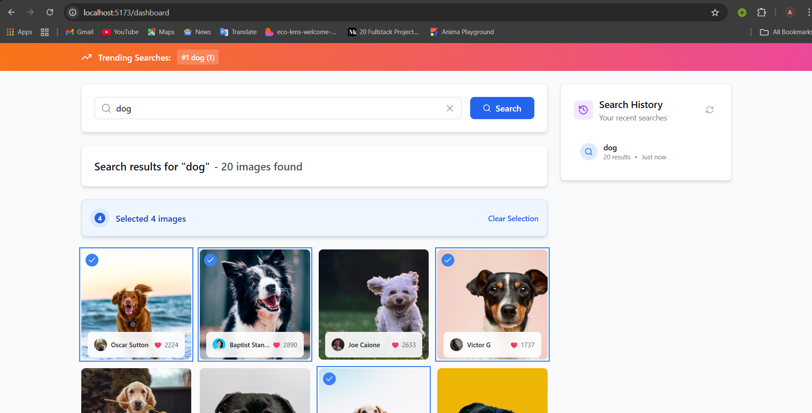

# Image Search MERN + OAuth Application

A full-stack image search application built with the MERN stack, OAuth authentication, and Tailwind CSS.

## 🚀 Features

- **🔐 OAuth Authentication** - Login with Google, Facebook, or GitHub
- **🔍 Image Search** - Search millions of high-quality images from Unsplash API
- **📊 Top Searches** - Real-time trending search terms across all users
- **📚 Search History** - Personal search history for each user
- **✅ Multi-Select** - Select multiple images with real-time counter
- **📱 Responsive Design** - Works perfectly on desktop and mobile

## 🛠️ Tech Stack

### Frontend
- **React.js** with Vite
- **Tailwind CSS** for styling
- **Axios** for API calls
- **React Router DOM** for routing
- **Lucide React** for icons

### Backend
- **Node.js** with Express.js
- **MongoDB** with Mongoose
- **Passport.js** for OAuth authentication
- **Express Session** for session management

### APIs Integrated
- **Unsplash API** for image search
- **Google OAuth 2.0** for authentication
- **Facebook OAuth** for authentication  
- **GitHub OAuth** for authentication

## 📦 Installation & Setup

### Prerequisites
- Node.js (v16 or higher)
- MongoDB (local or Atlas)
- OAuth app credentials (Google, Facebook, GitHub)
- Unsplash API access key

### 1. Clone the Repository
```bash
git clone <your-repository-url>
cd image-search-mern-oauth
```

### 2. Backend Setup
```bash
cd server
npm install
```

#### Create server/.env:
```bash
PORT=5000
NODE_ENV=development
MONGODB_URI=mongodb://localhost:27017/imageSearchApp
SESSION_SECRET=your_super_secure_session_secret_key_change_this

GOOGLE_CLIENT_ID=your_google_oauth_client_id_here
GOOGLE_CLIENT_SECRET=your_google_oauth_client_secret_here
FACEBOOK_APP_ID=your_facebook_app_id_here
FACEBOOK_APP_SECRET=your_facebook_app_secret_here
GITHUB_CLIENT_ID=your_github_client_id_here
GITHUB_CLIENT_SECRET=your_github_client_secret_here

UNSPLASH_ACCESS_KEY=your_unsplash_access_key_here
CLIENT_URL= http://localhost:5173
```

### 3. Frontend Setup
```bash
cd ../client
npm install
```

#### Create client/.env:
VITE_API_BASE_URL=http://localhost:5000
VITE_APP_NAME=Image Search App

### Start both frontend and backend
cd server
"npm run dev" for both frontend and backend

The application will be available at:
Frontend: http://localhost:5173
Backend API: http://localhost:5000


## 🔌 API Endpoints
#### Authentication Routes
GET /auth/google - Google OAuth login

GET /auth/facebook - Facebook OAuth login

GET /auth/github - GitHub OAuth login

GET /auth/logout - Logout user

GET /auth/currentUser - Get current user

#### Protected API Routes
GET /api/topSearches - Get top 5 search terms across all users

POST /api/search - Search images from Unsplash API

GET /api/history - Get user's search history


## API Usage Examples
#### API Usage Examples
```bash
curl -X POST http://localhost:5000/api/search \
  -H "Content-Type: application/json" \
  -c cookies.txt -b cookies.txt \
  -d '{"term": "nature"}'
```

#### Get Top Searches
```bash
curl -X GET http://localhost:5000/api/topSearches \
  -H "Content-Type: application/json" \
  -c cookies.txt -b cookies.txt
```

#### Get Search History
```bash
curl -X GET http://localhost:5000/api/history \
  -H "Content-Type: application/json" \
  -c cookies.txt -b cookies.txt
```


## **Folder Structure**
#### **Frontend (Client)**
- **`/client`** - React application built with Vite
- **`/src/components`** - All React UI components
- **`/src/context`** - Global state management (authentication)
- **`/src/hooks`** - Reusable custom React hooks
- **`/src/utils`** - Helper functions and API utilities

#### **Backend (Server)**
- **`/server`** - Node.js Express API server
- **`/config`** - OAuth configuration with Passport.js
- **`/middleware`** - Custom middleware for authentication
- **`/models`** - MongoDB database schemas
- **`/routes`** - API endpoint definitions

#### **Key Files**
- **`AuthContext.jsx`** - Manages user authentication state
- **`passportConfig.js`** - Configures OAuth strategies
- **`apiRoutes.js`** - Contains all protected API endpoints
- **`.env files`** - Store environment variables and API keys


## 🗃️ Database Models
#### User Model
{
  googleId: String,
  facebookId: String,
  githubId: String,
  name: String,
  email: String,
  profilePhoto: String,
  createdAt: Date,
  lastLogin: Date
}

#### SearchHistory Model
{
  userId: ObjectId,
  term: String,
  timestamp: Date,
  resultCount: Number
}


## Postman Collection
You can test all API endpoints using the Postman collection below -
[Download Postman Collection](postman/project_postman_collection.json)


## 📸 Screenshots
### Login Page
<div align="center">
  
</div>

### Home Page
<div align="center">
  
</div>

### Image Search Result
<div align="center">
  
</div>

### Mark down Image Result + Top Searches banner Update + Search  History Update  
<div align="center">
  
</div>


